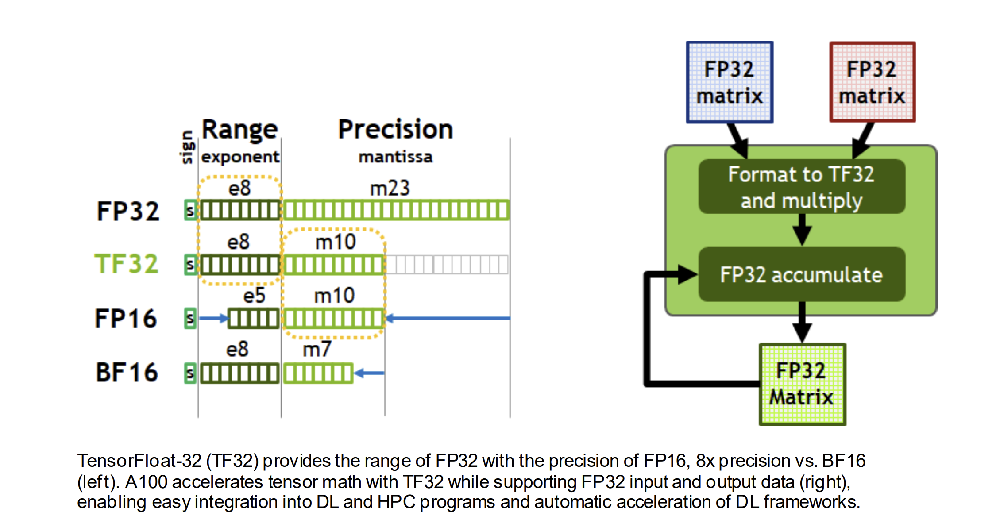

# Building GPT-2
1. Reproduced and optimized a GPT-2 124M model using transformers-based architecture, implementing several advanced techniques to enhance performance and efficiency, following Andrej Karpathy's lecture series.

2. Following the original paper, added technical improvements such as weight sharing, Adam optimizer, and gradient clipping.

3. Enhancements: Employed torch.compile() for AOT compilation, reducing kernel launch overhead and enhancing execution speed. Adjusted vocab size from 50257 to 50304 using power-of-two padding for computational efficiency. Implemented precision control with float32 and bfloat16, FlashAttention, AdamW optimizer, cosine decay learning scheduler, weight decay, and gradient accumulation.

4. Achieved a HellaSwag score of 0.3337 and validation loss of 2.9478 using 4 V100 GPUs, compared to the original GPT-2 124M validation loss of 3.12, after training for 2 full days.
 
- Video Lecture: [Let's reproduce GPT-2 (124M) YouTube lecture](https://youtu.be/l8pRSuU81PU)
- Lecture Repo : [Andrej-Karpathy NanoGPT](https://github.com/karpathy/build-nanogpt)


### Transformers Block:
**MHSA**: Captures contextual information from the entire sequence. <br>
**FFN**: Applies non-linear transformations to enrich the feature representations.

```
Input ---> LayerNorm ---> MHSA ---> Add (Residual Connection) ---> LayerNorm ---> FFN ---> Add (Residual Connection) ---> Output
```
adding the outputs of these sub-blocks to the residual stream, the transformer maintains the original input information
```
ln_1 = nn.LayerNorm(config.n_embd)
attn = CasualSelfAttention(config)
ln_2 = nn.LayerNorm(config.n_embd)
mlp = MLP(config)
```

| **MapReduce**                     | **Transformer Attention Equivalent**                                                                                        |
| ------------------------------------------- | --------------------------------------------------------------------------------------------------------------------------- |
| `map(x) → (k, v)`                           | Each input vector `xᵢ` produces a **key** `kᵢ = xᵢW_K` and a **value** `vᵢ = xᵢW_V`.                                        |
| `query` not in MapReduce                    | Each position `i` in the input also computes a **query** `qᵢ = xᵢW_Q`.                                                      |
| `shuffle and group by key`                  | Soft matching: For each `qᵢ`, compute dot-product similarity with all keys `kⱼ`, yielding weights `αᵢⱼ = softmax(qᵢ ⋅ kⱼ)`. |
| `reduce` by aggregating values for each key | Attention output `oᵢ = Σⱼ αᵢⱼ ⋅ vⱼ` is a weighted combination of value vectors.                                             |


- variances in the residual stream can grow significantly as the depth of the model increases.
- scaling factor, to control activations is 1/sqrt(n), n = number of layers.
- form of normalized initialization like Xavier or He.
- Weight intialization with std = 0.02 and conditional scaling for deeper networks


#### Optimization Steps taken: 

1. **Weight sharing schemes :** 
    - wte and lm_head have same embeddings
    - input and output embeddings usually same: synonymns have same probabilites

3. **Precision of matrix multiplication :**
    - control precision with tensorfloat32 (TF32), not default FP32. 
    - Ensure higher accuracy in matrix multiplication operations
    - potential cost of slower performance. 
    - `torch.set_float32_matmul_precision('high')`

4. **Typecast to bfloat16 :**

    - 1 bit for the sign.
    - 8 bits for the exponent.
    - 7 bits for the fraction (mantissa).
    - Range and Precision: The exponent in BFLOAT16 is the same as in FP32, which means it has the same range (from very small to very large numbers). However, the precision is lower due to having fewer bits for the fraction.
    - BFLOAT16 uses half the memory of FP32 
    - Modern GPUs and TPUs often have optimized paths for BFLOAT16 arithmetic.

5. **Torch.compile() :**
    - Ahead-Of-Time (AOT) compilation techniques = faster execution times
    - does not use the standard python interpreter - which does not know what comes next.
    - convert model to optimized intermediate representation - fusees multiple small operations into single larger one, reducing overhead of launching kernels on hardware.
    - reduces to-s and fros between memory
    - cant find flash attention though

6. **Switch to Flash Attention :**
    - Kernel Fusion: By fusing multiple steps of the attention calculation into a single kernel, FlashAttention reduces the overhead of launching multiple separate kernels, leading to faster execution times.
    - Intermediate attention state in not materialized.

7. **Nice Numbers :**
    - vocab size 50257 -> 50304 nice
    - avoid ugly numbers and use power of two's
    - pad vocab_size to nice, then drive probablities to zeros, for extra tokens to you have which you know arent in dataset. These extra tokens though never appear in the dataset, so their probabilities are driven to 0 by softmax.

8. **AdamW params :**
    - `AdamW(model.parameters(), lr=3e-4, betas=(0.9, 0.95), eps=1e-8)` 
    - beta1: running average of the gradient. Represents the momentum term.
    - beta2: running average of the squared gradient. Represents the adaptive learning rate term. More responsive to recent changes = fast convergence.
    - eps: small constant added to the denominator of the update step to improve numerical stability.

9. **Grad Clipping :**
    - `torch.nn.utils.clip_grad_norm_(model.parameters(), 1.0)`
    - prevent model shock, exploding gradient, overshooting gradients

10. **Cosine Decay Learning Scheduler :**
    - reduce the learning rate during training using a cosine function.

11. **Weight Decay Paramerter :**
    - done for parameters in participating in matrix multiplication and embeddings
    - prevent overfitting by adding a penalty to the loss function for large weights
    - use fused adam optimizer (hardware efficient)

12. **Gradient Accumulation :**
    - increase batch_size without increasing memory footprint (for 1M params)
    - Instead of updating the model's weights after each mini-batch, gradients are accumulated over multiple mini-batches (called accumulation steps).
    - Instead of updating the weights, add (accumulate) the gradients to a running sum.

13. **Distributed Training :**
    - Use DDP (distributed Data Parallel) 
14. **Use int8 for inferencing :**
    - we dont need high precision or floating points, so int will work too


### Paper Links:
- [Transformers Architecture: Attention Is All You Need](https://arxiv.org/pdf/1706.03762)
- [GPT2 Model](https://d4mucfpksywv.cloudfront.net/better-language-models/language-models.pdf)
- [nvidia-ampere-architecture-whitepaper](https://images.nvidia.com/aem-dam/en-zz/Solutions/data-center/nvidia-ampere-architecture-whitepaper.pdf)

