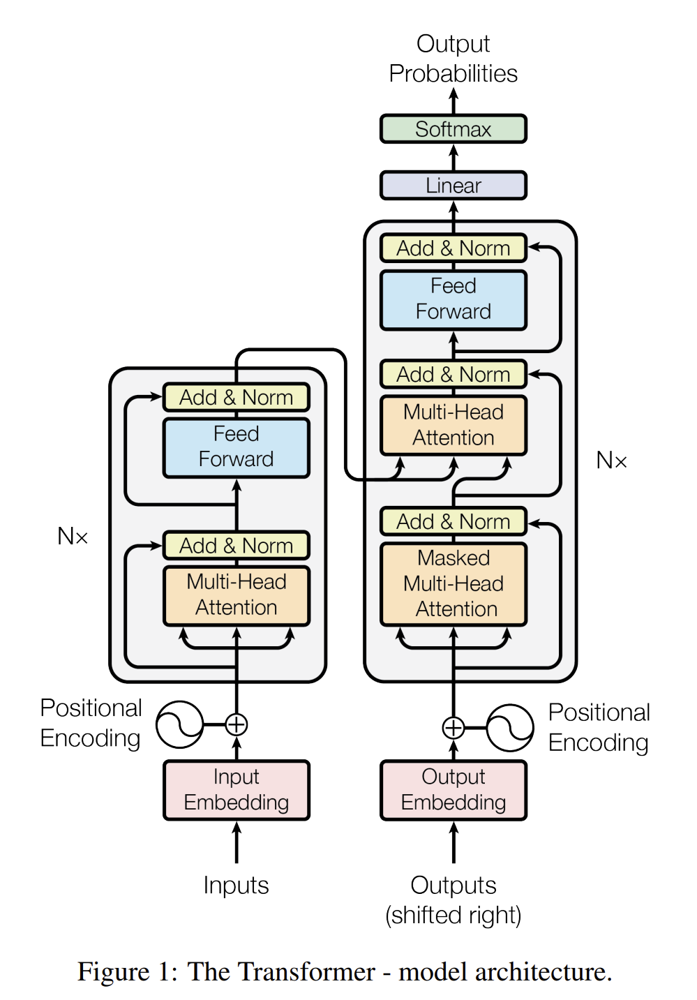

# Building GPT-2
- Inspired from : [Andrej-Karpathy NanoGPT](https://github.com/karpathy/build-nanogpt)
- Video Lecture: [Let's reproduce GPT-2 (124M) YouTube lecture](https://youtu.be/l8pRSuU81PU)

## Notes

#### Optimization Steps taken: 
1. Weight sharing schemes : wte and lm_head have same embeddings, input and output embeddings usually same: synonymns have same probabilites
1. Weight initialization: with std = 0.02 and conditional scaling for deeper networks
1. Controlling precision of matrix multiplication, with float32. Ensure higher accuracy in matrix multiplication operations, at the potential cost of slower performance. :  `torch.set_float32_matmul_precision('high')`
- variances in residual stream grows, so scaling factor 1/sqrt(n), to control activations
- every layer in traansformers has 2 blocks that add to residual networks.
## Increasing Training Speed
- use int8 for inferencing not 
2. TensorCore NVIDIA PAPER: 
- pytorch autocast, turning in bfloat16
- torch.compile() - reduces to-s and fros between memory, although can't find FLASH Attention
- Kernel Fusion
- Avoid Ugly numbers, use power of 2's
- driving probablities to zeros, for extra tokens to you have which you know arent in dataset, drive them to zero.
- Gradient Clipping, to prevent model shock
- Cosine decay learning scheduler
- weight decay parameter - done for parameters in participating in matrix multiplication and embeddings : optimizing in AdamW
- Gradient accumulation, in paralled distribution

